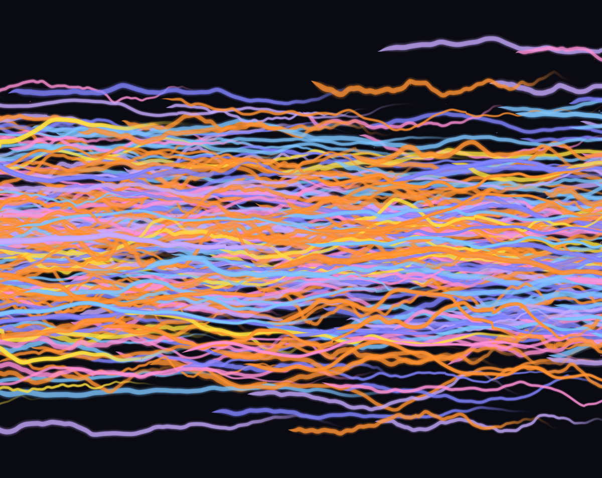

# ourfeelings.art

A living river of human emotion. Watch colorful ribbons drift across your screen — each one a feeling shared by someone, somewhere in the world.

**[View Live →](https://ourfeelings.art)**



## How It Works

1. **Choose a feeling** — Select from emotions like calm, love, hope, or melancholy
2. **Watch it flow** — Your feeling becomes a glowing ribbon, joining hundreds of others in the river
3. **See the world's mood** — Ribbons from people around the globe drift past, fading after 7 days

The river is always moving, always changing — a collective artwork created by strangers.

## Built With

- **Next.js 16** — React framework with App Router
- **Vercel KV** — Redis-based storage for feelings
- **WebGL2** — Hardware-accelerated ribbon rendering with glow effects
- **Framer Motion** — Smooth UI animations
- **Tailwind CSS 4** — Styling

## Architecture

```
┌─────────────┐     ┌─────────────┐     ┌─────────────┐
│   Browser   │────▶│  Next.js    │────▶│  Vercel KV  │
│   WebGL2    │◀────│  API Routes │◀────│   (Redis)   │
└─────────────┘     └─────────────┘     └─────────────┘
```

Feelings are stored with a 7-day TTL. Returning visitors can update their feeling after a cooldown period, keeping the river fresh and personal.

## Local Development

```bash
# Install dependencies
npm install

# Set up environment variables
cp .env.example .env.local
# Add your Vercel KV credentials to .env.local

# Run development server
npm run dev
```

Open [http://localhost:3000](http://localhost:3000) to see the river.
